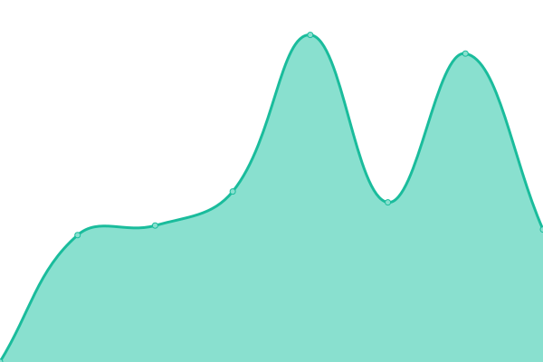
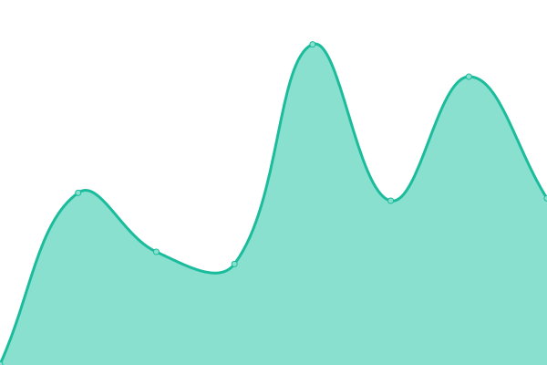

# [📈 Live Status](https://germanoddo.github.io/webstatus): <!--live status--> **🟩 All systems operational**

This repository contains the open-source uptime monitor and status page for [germanoddo](https://germanoddo.github.io/webstatus), powered by [Upptime](https://github.com/upptime/upptime).

With [Upptime](https://upptime.js.org), you can get your own unlimited and free uptime monitor and status page, powered entirely by a GitHub repository. We use [Issues](https://github.com/germanoddo/webstatus/issues) as incident reports, [Actions](https://github.com/germanoddo/webstatus/actions) as uptime monitors, and [Pages](https://germanoddo.github.io/webstatus) for the status page.

<!--start: status pages-->
<!-- This summary is generated by Upptime (https://github.com/upptime/upptime) -->
<!-- Do not edit this manually, your changes will be overwritten -->
<!-- prettier-ignore -->
| URL | Status | History | Response Time | Uptime |
| --- | ------ | ------- | ------------- | ------ |
|  [Prex-Argentina](https://www.prexcard.com.ar) | 🟩 Up | [prex-argentina.yml](https://github.com/german-oddo/webstatus/commits/HEAD/history/prex-argentina.yml) | 

 248ms
     
 | 

<a href="https://prexcard.github.io/webstatus/history/prex-argentina">100.00%</a>
    

|  [API Prex-Argentina](https://api.prexcard.com.ar/) | 🟩 Up | [api-prex-argentina.yml](https://github.com/german-oddo/webstatus/commits/HEAD/history/api-prex-argentina.yml) | 

 252ms
     
 | 

<a href="https://prexcard.github.io/webstatus/history/api-prex-argentina">100.00%</a>
    

|  [Prex-Chile](https://prexcard.cl/) | 🟩 Up | [prex-chile.yml](https://github.com/german-oddo/webstatus/commits/HEAD/history/prex-chile.yml) | 

 358ms
     
 | 

<a href="https://prexcard.github.io/webstatus/history/prex-chile">100.00%</a>
    

|  [Prex-Perú](https://www.prex.com.pe) | 🟩 Up | [prex-peru.yml](https://github.com/german-oddo/webstatus/commits/HEAD/history/prex-peru.yml) | 

 738ms
     
 | 

<a href="https://prexcard.github.io/webstatus/history/prex-peru">99.94%</a>
    

|  [API Prex-Perú](https://api.prex.com.pe/) | 🟩 Up | [api-prex-peru.yml](https://github.com/german-oddo/webstatus/commits/HEAD/history/api-prex-peru.yml) | 

 433ms
     
 | 

<a href="https://prexcard.github.io/webstatus/history/api-prex-peru">100.00%</a>
    

|  [Prex-Uruguay](https://www.prexcard.com) | 🟩 Up | [prex-uruguay.yml](https://github.com/german-oddo/webstatus/commits/HEAD/history/prex-uruguay.yml) | 

 225ms
     
 | 

<a href="https://prexcard.github.io/webstatus/history/prex-uruguay">100.00%</a>
    

|  [API Prex-Uruguay](https://www.prexcard.com/api/) | 🟩 Up | [api-prex-uruguay.yml](https://github.com/german-oddo/webstatus/commits/HEAD/history/api-prex-uruguay.yml) | 

 144ms
     
 | 

<a href="https://prexcard.github.io/webstatus/history/api-prex-uruguay">100.00%</a>
    

<!--end: status pages-->

[**Visit our status website →**](https://germanoddo.github.io/webstatus)

## 📄 License

- Powered by: [Upptime](https://github.com/upptime/upptime)
- Code: [MIT](./LICENSE) © [germanoddo](https://germanoddo.github.io/webstatus)
- Data in the `./history` directory: [Open Database License](https://opendatacommons.org/licenses/odbl/1-0/)
